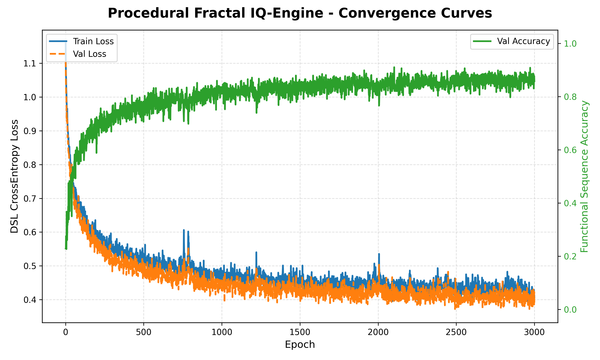

# Universal Pattern Inductor

A PyTorch-based meta-learning framework capable of **inducing hidden transformation rules** from a few context examples (In-Context Learning) and **programmatically synthesizing** a deterministic algorithm to apply them to new queries.

Instead of direct regression, the model learns to synthesize discrete programs in a Domain-Specific Language (DSL) that dynamically transforms multi-dimensional input arrays.

---

## 🌟 Key Features

* **In-Context Meta-Learning**: The model deduces complex transformation rules from just 2–4 context examples without updating its neural network weights.
* **Program Synthesis & Interpretability**: Deduces discrete programs consisting of DSL tokens rather than raw outputs, making the "thinking process" of the model 100% auditable and interpretable.
* **Vectorized Execution**: A deterministic execution engine (`ExecutionEngine`) executes synthesized DSL programs directly on PyTorch tensors.
* **Differentiable Inference / Test-Time Optimization (TTO)**: Dynamically refines predicted program logits during inference using gradient descent on context examples.
* **Zero-Shot Generalization**: Successfully generalizes to longer operation sequences and unseen test environments.

---

## 📊 Training & Convergence

Below are the training convergence curves for **Phase 3 (Crystallized Meta-IQ Benchmark)**. The metrics plot shows both training and validation losses alongside the Functional Sequence Accuracy (strict all-or-nothing matching on unseen validation rules):



### Metric Details:
- **Left Y-Axis (Blue/Orange)**: DSL Cross-Entropy loss on program tokens (decreases steadily as the model learns).
- **Right Y-Axis (Green)**: Strict Functional Sequence Accuracy (reaches peak validation performance on unseen procedural rules).

---

## ⚙️ Core Architecture

The architecture consists of three core components:

1. **Micro-Worlds (Data Layer)**:
   Generators of meta-learning episodes (tasks). The main engine is `FractalIQEngine` which chains up to 3 randomized operations from a dictionary of 24 DSL operations.
2. **IQ-Module (Model Layer - `IQMicroUnit`)**:
   A Transformer-based causal autoregressive model. It projects context inputs and targets, concatenates them with the query instance, and generates program tokens causal-masked step-by-step.
3. **Execution Engine (Interpreter Layer - `ExecutionEngine`)**:
   Directly executes the 24 DSL operations on size-5 tensors.

### DSL Operation Vocabulary (24 operations)
- **Geometric/Array transformations**: `REVERSE` (1), `SHIFT_R` (2), `SHIFT_L` (3), `SWAP_HALVES` (4), `SORT_ASC` (5), `SORT_DESC` (6)
- **Math/Arithmetic**: `CUMSUM` (7), `CUMPROD` (8), `DIFF` (9), `RUNNING_MEAN` (10), `INVERT_SIGN` (11), `ABS` (12), `ROUND` (13), `CEIL` (14), `FLOOR` (15), `LOG_TRANSFORM` (16)
- **Masking/Filtering**: `MASK_GT_ZERO` (17), `MASK_LT_ZERO` (18), `BINARIZE` (19), `INVERT_MASK` (20), `CLAMP_UNIT` (21), `ARGMAX_ONEHOT` (22), `ARGMIN_ONEHOT` (23)

---

## 🚀 Quick Start

### Installation
Ensure you have Python 3.10+ and PyTorch installed:
```bash
pip install torch numpy matplotlib
```

### Running Interactive Demonstration
Run the interactive helper to input context examples manually and see how the model deduces the rule and applies it to a query:
```bash
python interactive_inference.py
```

### Evaluating on Out-Of-Distribution (OOD) Rules
To evaluate the zero-shot generalization of the trained model (evaluating depth 3 rules when trained on depth 2):
```bash
python eval_procedural_inference.py
```

---

## 📁 File Structure

- `model.py` — Deep learning architectures (`IQMicroUnit` and `UniversalMicroUnit`).
- `worlds.py` — Interactive micro-worlds and procedural generators (`FractalIQEngine`, `IQPatternWorld`).
- `execution_engine.py` — Deterministic DSL vectorized interpreter.
- `trainer.py` — Optimization loops (Teacher Forcing, Autoregressive evaluation).
- `interactive_inference.py` — Console demonstration helper.
- `eval_procedural_inference.py` — Evaluation with Test-Time Optimization (TTO).
- `watch_log.py` — Streaming utility for validation logs.
