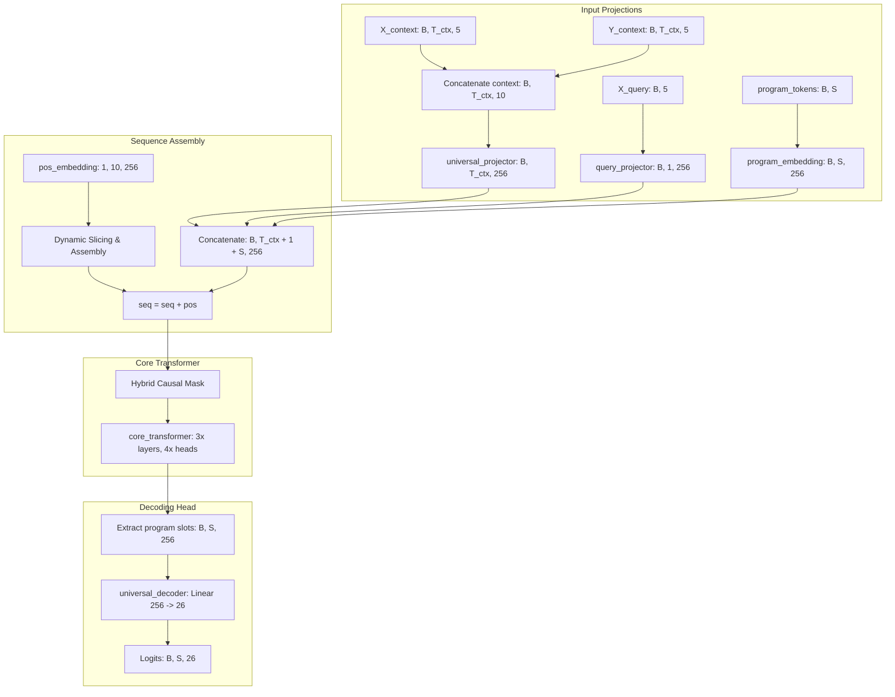

# Принцип работы модели IQ-системы на базе Chain-of-Thought и Causal Autoregressive Decoder (Phase 6.1)

Этот документ содержит исчерпывающее техническое описание архитектуры, структуры данных, математических операций, процесса обучения и логики вывода текущей версии модели (`IQMicroUnit`).

---

## 1. Основная концепция: Программный синтез вместо регрессии

В ранних фазах проекта система пыталась решить логические задачи с помощью непрерывной регрессии (минимизация MSE между предсказанным вещественным вектором и истинным таргетом). Этот подход не позволял сети выучивать дискретные алгоритмические правила.

В текущей версии система переведена на парадигму **Программного Синтеза (Program Synthesis) с цепочкой рассуждений (Chain-of-Thought, CoT)**:
1. Модель получает на вход контекстные примеры преобразований вещественных векторов размера 5 (например, `[X -> Y]`) и тестовый запрос `X_query`.
2. Вместо прямого предсказания результирующего вектора `Y_query`, модель генерирует **цепочку дискретных инструкций (программу)** на специальном предметно-ориентированном языке (DSL).
3. Сгенерированная программа передается детерминированному виртуальному исполнителю (`ExecutionEngine`), который последовательно применяет каждую операцию к вектору `X_query` для получения точного ответа.

### Словарь DSL (Vocabulary size = 26)
* **0**: `PAD (no-op)` — токен заполнения пустоты.
* **1-6**: **Геометрические операции** (разворот массива, сдвиги влево/вправо, перестановка половин, сортировки).
* **7-10**: **Математический анализ** (накопительная сумма/произведение, разности, скользящее среднее).
* **11-16**: **Арифметика** (инверсия знака, модуль, округление, ceil, floor, логарифмическое преобразование).
* **17-23**: **Маски и логика** (выделение элементов больше/меньше нуля, бинаризация, инверсия маски, argmax/argmin в one-hot).
* **24**: `STOP` — токен завершения выполнения программы.
* **25**: `START` — служебный токен начала генерации.

---

## 2. Архитектура модели (`IQMicroUnit`)

Модель построена на базе классического Трансформера-Кодировщика (Transformer Encoder) с **гибридной причинно-следственной маской внимания**.

### 2.1 Проекции входов (Input Projections)
Поскольку входные данные имеют разную природу, перед подачей в трансформер они проецируются в общее скрытое пространство размерности `hidden_dim = 256`:

1. **Контекстные пары (Context Pairs)**:
   Входы `X_context` и `Y_context` конкатенируются по последней оси:
   $$\text{ctx\_pairs} = [X_{\text{context}} \mathbin{\Vert} Y_{\text{context}}] \quad (\text{shape: } [B, T_{\text{ctx}}, 10])$$
   Затем они проходят через MLP-проектор:
   $$\text{ctx\_proj} = \text{universal\_projector}(\text{ctx\_pairs}) \quad (\text{shape: } [B, T_{\text{ctx}}, 256])$$

2. **Запрос (Query Input)**:
    вещественный вектор запроса `X_query` проецируется через линейный слой и расширяется по оси последовательности:
   $$\text{qry\_proj} = \text{query\_projector}(X_{\text{query}}). \text{unsqueeze}(1) \quad (\text{shape: } [B, 1, 256])$$

3. **Токены программы (Program Tokens)**:
   Дискретные токены сгенерированной на данный момент программы `program_tokens` (индексы `0..25`) проецируются через обучаемую матрицу эмбеддингов:
   $$\text{prog\_proj} = \text{program\_embedding}(\text{program\_tokens}) \quad (\text{shape: } [B, S, 256])$$

### 2.2 Сборка последовательности (Sequence Layout)
Все спроецированные векторы объединяются в одну длинную последовательность по размерности токенов:
$$\text{seq} = [\text{ctx\_proj} \mathbin{\Vert} \text{qry\_proj} \mathbin{\Vert} \text{prog\_proj}] \quad (\text{shape: } [B, L, 256])$$
Где общая длина последовательности:
$$L = T_{\text{ctx}} + 1 + S$$

---

## 3. Математика позиционных эмбеддингов и маскирования

Динамическое изменение длины последовательности требует строгого контроля за тем, как токены взаимодействуют друг с другом.

### 3.1 Динамические позиционные эмбеддинги (Dynamic Positional Embeddings)
В модели определен глобальный обучаемый параметр позиций для максимальной длины 10:
$$\text{pos\_embedding} \in \mathbb{R}^{1 \times 10 \times 256}$$

Чтобы модель корректно работала как во время обучения (4-shot контекст, $T_{ctx} = 4$), так и во время Holdout-валидации (2-shot контекст, $T_{ctx} = 2$), позиционные эмбеддинги нарезаются и сшиваются динамически под текущую структуру:
* $\text{pos\_ctx} = \text{pos\_embedding}[:, 0 : T_{\text{ctx}}, :]$ — позиции контекстных примеров.
* $\text{pos\_qry} = \text{pos\_embedding}[:, T_{\text{ctx}} : T_{\text{ctx}} + 1, :]$ — позиция запроса (всегда сразу после контекста).
* $\text{pos\_prog} = \text{pos\_embedding}[:, T_{\text{ctx}} + 1 : T_{\text{ctx}} + 1 + S, :]$ — позиции токенов программы.

Сшитый позиционный вектор добавляется к последовательности:
$$\text{seq} = \text{seq} + [\text{pos\_ctx} \mathbin{\Vert} \text{pos\_qry} \mathbin{\Vert} \text{pos\_prog}]$$

### 3.2 Гибридная причинная маска (Hybrid Causal Mask)
Для обеспечения корректной работы авторегрессии строится маска внимания $M \in \mathbb{R}^{L \times L}$, где значение $-\infty$ запрещает внимание, а $0.0$ разрешает его:

1. **Контекст и Запрос (двунаправленное внимание)**:
   Токены с индексами от $0$ до $T_{ctx}$ могут свободно смотреть друг на друга. Модель должна сопоставлять входные вещественные векторы примеров и запроса без ограничений.
   $$M_{i, j} = 0.0 \quad \text{при } i, j \le T_{\text{ctx}}$$

2. **Токены программы (причинное внимание)**:
   Каждый сгенерированный токен программы на позиции $i > T_{ctx}$ может смотреть на контекст, запрос и только на *предыдущие* сгенерированные токены программы (индексы $\le i$). Он не должен заглядывать в будущее.
   $$M_{i, j} = \begin{cases} 
      0.0 & \text{если } j \le i \\
      -\infty & \text{если } j > i 
   \end{cases} \quad \text{при } i > T_{\text{ctx}}$$

Визуализация матрицы маски $M$ для $T_{ctx} = 4$ и $S = 3$ ($L = 8$):

| Индекс токена | 0 (C) | 1 (C) | 2 (C) | 3 (C) | 4 (Q) | 5 (P1) | 6 (P2) | 7 (P3) |
| :--- | :---: | :---: | :---: | :---: | :---: | :---: | :---: | :---: |
| **0 (Context)** | 0.0 | 0.0 | 0.0 | 0.0 | 0.0 | $-\infty$ | $-\infty$ | $-\infty$ |
| **1 (Context)** | 0.0 | 0.0 | 0.0 | 0.0 | 0.0 | $-\infty$ | $-\infty$ | $-\infty$ |
| **2 (Context)** | 0.0 | 0.0 | 0.0 | 0.0 | 0.0 | $-\infty$ | $-\infty$ | $-\infty$ |
| **3 (Context)** | 0.0 | 0.0 | 0.0 | 0.0 | 0.0 | $-\infty$ | $-\infty$ | $-\infty$ |
| **4 (Query)** | 0.0 | 0.0 | 0.0 | 0.0 | 0.0 | $-\infty$ | $-\infty$ | $-\infty$ |
| **5 (Program 1)**| 0.0 | 0.0 | 0.0 | 0.0 | 0.0 | 0.0 | $-\infty$ | $-\infty$ |
| **6 (Program 2)**| 0.0 | 0.0 | 0.0 | 0.0 | 0.0 | 0.0 | 0.0 | $-\infty$ |
| **7 (Program 3)**| 0.0 | 0.0 | 0.0 | 0.0 | 0.0 | 0.0 | 0.0 | 0.0 |

---

## 4. Обучение модели: Teacher Forcing

Во время обучения (метод `train_epoch` в `ProceduralIQTrainer`) мы используем **учительское принуждение (Teacher Forcing)** для ускорения сходимости. Вместо того чтобы генерировать токены по одному, мы передаем всю истинную цепочку операций сразу, сдвинутую вправо:

1. Пусть истинная цепочка операций (target) имеет вид:
   $$\text{chain\_ops} = [\text{OP}_1, \text{OP}_2, \text{STOP}, \text{PAD}, \text{PAD}] \quad (\text{shape: } [B, 5])$$
2. Мы конструируем входные токены программы, добавляя токен `START` (25) в начало и отрезая последний элемент:
   $$\text{program\_tokens} = [\text{START}, \text{OP}_1, \text{OP}_2, \text{STOP}, \text{PAD}] \quad (\text{shape: } [B, 5])$$
3. Передаем `program_tokens` в модель. Благодаря причинной маске:
   * На позиции `START` модель предсказывает вероятность следующего токена (таргет: `OP_1`).
   * На позиции `OP_1` модель предсказывает таргет `OP_2`.
   * На позиции `OP_2` модель предсказывает таргет `STOP`.
   * И так далее.
4. Вычисляем CrossEntropy Loss между выходами модели и `chain_ops` по всем позициям:
   $$\text{Loss} = \text{CrossEntropy}(\text{logits.transpose}(1, 2), \text{chain\_ops})$$

---

## 5. Инференс и Валидация: Пошаговый Авторегрессионный Вывод

Во время валидации и тестирования истинные операции скрыты. Модель генерирует программу пошагово:

1. **Инициализация**:
   Задается начальный вектор программы, состоящий только из токена `START`:
   $$\text{current\_program} = [\text{START}] \quad (\text{shape: } [B, 1])$$
2. **Шаг генерации $t$** (от 0 до 4):
   * Модель делает прямой проход:
     $$\text{logits} = \text{model}(X_{\text{context}}, Y_{\text{context}}, X_{\text{query}}, \text{program\_tokens}=\text{current\_program})$$
     Здесь размерность выходных логитов: $[B, S, 26]$, где $S = t + 1$.
   * Извлекаются логиты *последнего* предсказанного токена (индекс $-1$):
     $$\text{next\_token\_logits} = \text{logits}[:, -1, :] \quad (\text{shape: } [B, 26])$$
   * Вычисляется следующий токен с максимальной вероятностью (или сэмплированием):
     $$\text{next\_token} = \text{argmax}(\text{next\_token\_logits}, \text{dim}=-1, \text{keepdim}=\text{True}) \quad (\text{shape: } [B, 1])$$
   * Токен добавляется в конец текущей последовательности:
     $$\text{current\_program} = [\text{current\_program} \mathbin{\Vert} \text{next\_token}] \quad (\text{shape: } [B, t + 2])$$
3. **Остановка**:
   Процесс повторяется 5 раз. Полученная цепочка токенов `pred_tokens` (размер $[B, 5]$) передается в исполняющий движок.

---

## 6. Детерминированное исполнение (`ExecutionEngine`)

После генерации последовательность токенов программы применяется к тестовому запросу `X_query`.

* **Семантика ранней остановки**:
  Если в батче присутствуют несколько примеров, и некоторые из них сгенерировали токен `STOP` (24) или `PAD` (0) раньше 5 шага, исполняющий движок отслеживает маску активных элементов `active` размера $[B]$.
  Как только для объекта в батче генерируется `STOP` или `PAD`, маска `active` для него сбрасывается в `False`, и все последующие операции на шагах $t+1, \dots$ для этого объекта игнорируются (вектор не изменяется).
* **Сравнение результатов**:
  Итоговый вектор, полученный после выполнения программы, сравнивается с истинным вещественным таргетом `Y_query`. Прогноз считается успешным (`SUCCESS`), только если все элементы вектора совпадают с точностью до $\epsilon = 0.01$.
