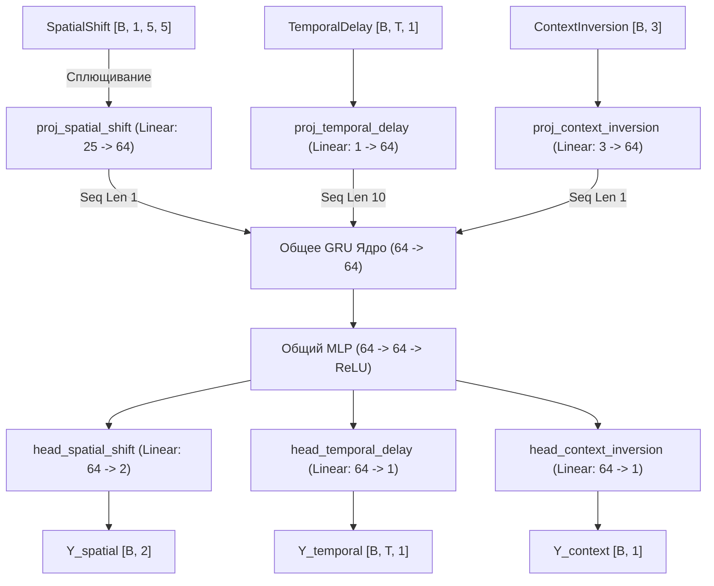

# Архитектура и Принципы Работы Нейросетевых Модулей (Phase 1, 2 и 3)

Данный документ подробно описывает архитектуру, структуру данных и логику работы двух ключевых нейросетевых моделей в рамках фреймворка исследования мета-обучения и индуктивного вывода: `UniversalMicroUnit` и `IQMicroUnit`.

---

## 1. UniversalMicroUnit (Phase 1: Многозадачное ядро)

`UniversalMicroUnit` — это легкий многозадачный модуль, предназначенный для одновременного решения статических и временны́х задач. Для предотвращения катастрофического забывания (catastrophic forgetting) веса сети разделены на две группы: **специфичные для задач проекции/головы** и **общее ядро (shared core)**.

### Архитектурные слои:
1. **Проекции входов (Task-Specific Input Projections):**
   * **SpatialShiftWorld:** Вход имеет форму `[B, 1, 5, 5]`. Он сглаживается в плоский вектор размерности `25` и проецируется через линейный слой `Linear(25, hidden_dim)`.
   * **TemporalDelayWorld:** Вход представляет собой временную последовательность `[B, T, 1]`. Каждая временная точка проецируется через `Linear(1, hidden_dim)`.
   * **ContextInversionWorld:** Вход — это вектор из 3 признаков (бит) `[B, 3]`. Проецируется через `Linear(3, hidden_dim)`.
   
2. **Общее рекуррентное ядро (Shared Recurrent Core):**
   * Проецированные векторы приводятся к общей последовательности и передаются в общую ячейку **GRU** (`input_size=hidden_dim, hidden_size=hidden_dim`). Для статических задач длина последовательности искусственно устанавливается равной 1.
   
3. **Общий полносвязный блок (Shared MLP Core):**
   * Выход GRU пропускается через общую полносвязную сеть: `Linear(hidden_dim, hidden_dim) -> ReLU()`.
   
4. **Специфичные выходы (Task-Specific Output Heads):**
   * **SpatialShiftWorld:** Выходной слой `Linear(hidden_dim, 2)` предсказывает координаты центра смещенного блока `(x, y)`.
   * **TemporalDelayWorld:** Выходной слой `Linear(hidden_dim, 1)` возвращает логиты для каждого временного шага последовательности.
   * **ContextInversionWorld:** Выходной слой `Linear(hidden_dim, 1)` предсказывает логит итоговой логической операции (XOR или OR).

### Схема потока данных (Phase 1)


---

## 2. IQMicroUnit (Phase 2 & 3: Мета-обучение и индуктивный вывод)

`IQMicroUnit` решает более сложную задачу: индуктивное определение скрытого правила трансформации по предоставленным примерам (In-Context Rule Induction) и его применение к новому запросу. Модуль масштабирован до `hidden_dim = 128` во избежание взаимного вытеснения представлений (representation crowding) при одновременном изучении 8 абстрактных правил.

Сеть обрабатывает два независимых потока данных: **поток контекста (Context Stream)** и **поток запроса (Query Stream)**.

### Архитектурные компоненты:

1. **Нелинейные кодировщики контекста (Task-Specific Context Encoders):**
   * Каждый пример контекста состоит из пары `(X_i, Y_i)` размерности `5 + 5 = 10`. Два таких примера объединяются в тензор формы `[B, 2, 10]`.
   * Для каждого из 8 правил определен свой нелинейный кодировщик-MLP: `Linear(10, 128) -> ReLU() -> Linear(128, hidden_dim)`. Нелинейность критически важна для разделения непрерывных вещественных шкал (арифметика, фибоначчи) и дискретных булевых/модульных шкал.
   
2. **Специфичные проекции запроса (Task-Specific Query Projections):**
   * Линейные слои `Linear(5, hidden_dim)` проецируют вектор запроса `X3` формы `[B, 5]` в скрытое пространство.
   
3. **Общее рекуррентное ядро (Shared Recurrent Core):**
   * Последовательность проецированных контекстных пар `[B, 2, hidden_dim]` передается в **GRU** (`input_size=hidden_dim, hidden_size=hidden_dim`).
   * GRU последовательно обрабатывает контекстные примеры. Его финальное скрытое состояние `h_en` формы `[B, hidden_dim]` является сжатым абстрактным представлением (латентным кодом) индицированного правила.
   
4. **Общий процессор запроса (Shared Query Processor):**
   * Вектор запроса `query_proj` конкатенируется с вектором правила `h_en` в единый вектор формы `[B, 2 * hidden_dim]` (размерность `256`).
   * Данный вектор пропускается через глубокий общий MLP: `Linear(256, 128) -> ReLU() -> Linear(128, 128) -> ReLU()`.
   
5. **Общая голова предсказания (Shared Prediction Head):**
   * Линейный слой `Linear(hidden_dim, 5)` возвращает итоговый спрогнозированный вектор `Y3` размерности `5`.

### Схема потока данных (Phase 3)
```mermaid
graph TD
    %% Context Stream
    subgraph Context Stream (Извлечение правила)
        X_ctx["X_context [B, 2, 5]"]
        Y_ctx["Y_context [B, 2, 5]"]
        Concat["Concat [B, 2, 10]"]
        X_ctx --> Concat
        Y_ctx --> Concat
        
        Encoder["Специфичный MLP-кодировщик<br>(10 -> 128 -> ReLU -> 128)"]
        Concat --> Encoder
        
        CtxProj["ctx_proj [B, 2, 128]"]
        Encoder --> CtxProj
        
        GRU["Общее GRU Ядро<br>(128 -> 128)"]
        CtxProj --> GRU
        
        H_en["h_en (Латентный код правила)<br>[B, 128]"]
        GRU --> H_en
    end

    %% Query Stream
    subgraph Query Stream (Вход запроса)
        X_qry["X_query [B, 5]"]
        QueryProj["Специфичная проекция запроса<br>(Linear: 5 -> 128)"]
        X_qry --> QueryProj
        
        QProjOut["query_proj [B, 128]"]
        QueryProj --> QProjOut
    end

    %% Fusion and Prediction
    subgraph Shared Query Processor & Output
        Condition["Конкатенация [B, 256]"]
        QProjOut --> Condition
        H_en --> Condition
        
        CoreMLP["Общий MLP-процессор запроса<br>(256 -> 128 -> ReLU -> 128 -> ReLU)"]
        Condition --> CoreMLP
        
        PredHead["Общая голова предсказания<br>(Linear: 128 -> 5)"]
        CoreMLP --> PredHead
        
        Y_pred["Y_pred (Целевой вектор запроса) [B, 5]"]
        PredHead --> Y_pred
    end
```

---

## 3. Балансировка функции потерь и градиентов

Так как 8 правил оперируют в разных математических пространствах, для их обучения используются различные лосс-функции:
* **Непрерывные правила (MSE):** `arithmetic`, `fibonacci`, `geometric`, `extremum` обучаются с помощью `nn.MSELoss()`.
* **Бинарные и модульные правила (BCE):** `cyclic`, `bitwise`, `inversion`, `modulo` (масштабированное делением на 4.0) обучаются с помощью `nn.BCEWithLogitsLoss()`.

Для предотвращения доминирования градиентов непрерывных функций над бинарными реализовано автоматическое масштабирование лоссов:
$$\text{Total Loss} = \sum_{i=1}^8 \text{Loss}_i \times \text{Weight}_i$$
где:
* $\text{Weight}_i = 1.0$ для задач с MSE.
* $\text{Weight}_i = 5.0$ для задач с BCE.

---

## 4. Метод верификации (Тест на абляцию контекста)

Для подтверждения того, что сеть действительно осуществляет индукцию правил из контекста в реальном времени, а не просто запоминает структуру `X_query` (query memorization), применяется **Context Ablation Test (Тест на абляцию контекста)**:
1. Во время валидации контекстные пары `(X_context, Y_context)` случайно перемешиваются между сэмплами батча.
2. В результате перемешивания контекст перестает соответствовать запросу `X_query`.
3. Если сеть опирается на индукцию правил из контекста, точность должна упасть до уровня случайного угадывания (chance-level):
   * Для циклических сдвигов и модульной арифметики (где сдвиги замкнуты): $< 35\%$.
   * Для остальных правил: $< 20\%$.
4. При правильном мета-обучении точность на валидации без абляции составляет $\ge 90\%$, а точность при абляции опускается ниже указанных порогов, проходя юнит-тест.
